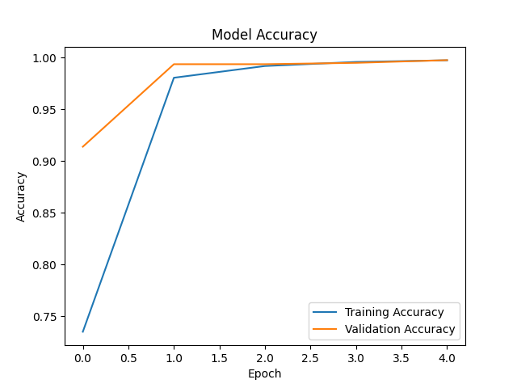
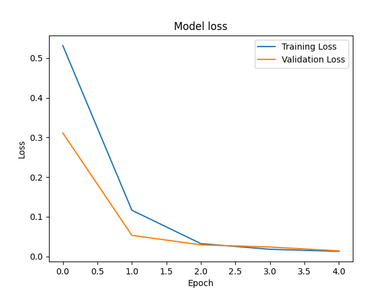
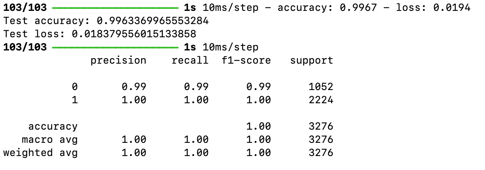
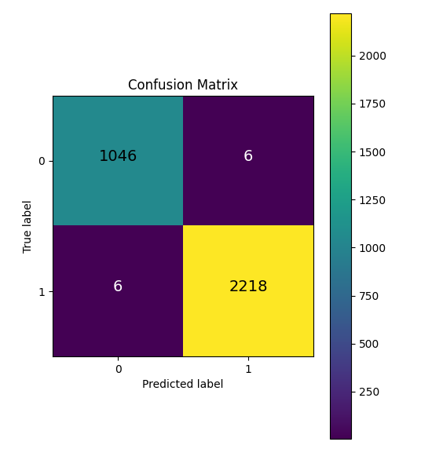

# Machine Learning for Cybersecurity: a defense system against Cross-Site Scripting attacks based on convolutional neural networks

This script is part of my thesis project implementing a cross-site scripting attack recognition system using convolutional neural networks.

The dataset used to train the model [Cross site scripting XSS dataset for Deep learning](https://www.kaggle.com/datasets/syedsaqlainhussain/cross-site-scripting-xss-dataset-for-deep-learning) was downloaded from Kaggle.


For the thesis project the model was integrated into a social media-like application, but can be integrated into any type of application that accepts textual input from the user.

In this repository only the code for the creation of the model is available.

## Repository Content

- `cnn_xss_detection.py`: This file contains the main code to load the dataset, preprocess the data, build and train the CNN model, and evaluate the performance of the model.
- `models/`: This folder contains the pre-trained model and the pre-trained vectorizer.
- `images/`: This folder contains images with graphs of the model's performance.

## Requirements

The following libraries are required to execute the code:

- numpy (numpy==1.26.4)
- pandas (pandas==2.2.2)
- keras (keras==3.3.2)
- sklearn (scikit-learn==1.4.2)
- matplotlib (matplotlib==3.8.4)
- joblib (joblib==1.4.0)
- tensorflow (tensorflow==2.16.1)


## Usage

It is recommended to use this code and the pre-trained model within a virtual environment to avoid conflicts between scripts.
### 1. Pre-trained model

You can load and use the pre-trained model and vectorizer available in the `models` folder with the name `model.h5` and `vectorizer.pkl` in the following way:

``` python
# Importing necessary libraries
from keras.models import load_model
import joblib
import numpy as np

# Loading pre-trained vectorizer
vectorizer = joblib.load('models/vectorizer.pkl')

# Loading pre-trained model
model = load_model('models/model.h5')

# Transforming input data using the vectorizer
X_test_transformed = vectorizer.transform(X_test)

# Adding a feature to meet the form that the network expects as input
new_feature = np.zeros((X_test_transformed.shape[0], 1))
X_test_transformed = np.hstack((X_test_transformed, new_feature))

# Using the model to make predictions
predictions = model.predict(X_test_transformed)

```
### 2. Train the model yourself

To train the model yourself:
1. download the dataset from Kaggle ([Cross site scripting XSS dataset for Deep learning](https://www.kaggle.com/datasets/syedsaqlainhussain/cross-site-scripting-xss-dataset-for-deep-learning))
2. make sure the file `XSS_dataset.csv` is in the same folder as the script
3. use the following command to execute the code: 

```bash
python cnn_xss_detection.py
``` 

## Performances 
The following images show the performances of the model.
#### Accuracy (training and validation set)

#### Loss (training and validation set)

#### Performance on test set

#### Confusion Matrix



## Author
[Alexandra Dragan](https://www.linkedin.com/in/alexandra-dragan-691791281/)

## License
This project is under [MIT](https://choosealicense.com/licenses/mit/) licence
